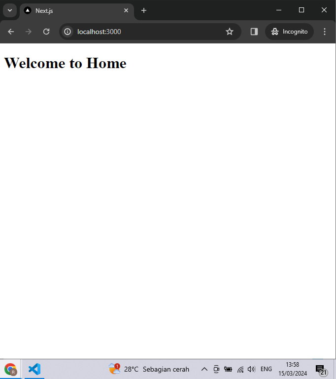
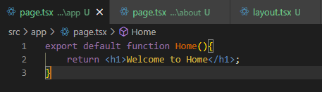
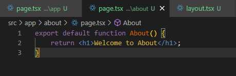
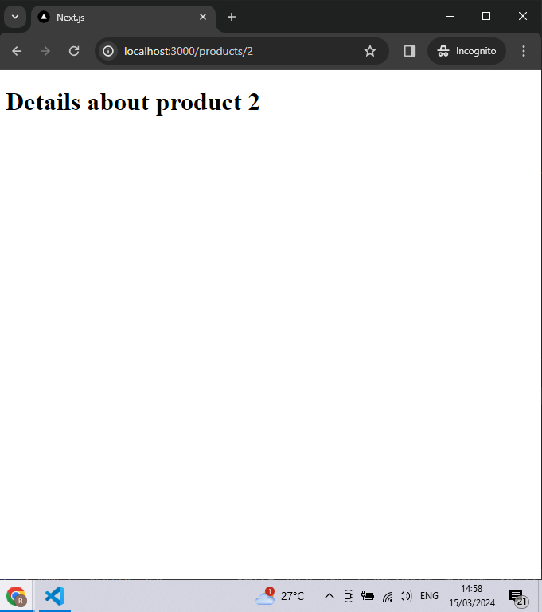

### Laporan Praktikum-5

|  | Pemrograman Berbasis Framework 2024 |
|--|--|
| NIM |  2141720166|
| Nama |  Raihan Dany Radhinnur |
| Kelas | TI - 3I |

## Practicum soal-1
Question Answer :
|
|
|
|

|
|

## Practicum soal-2
Apa kekurangan yang mungkin terjadi jika menggunakan pendekatan pada Praktikum 2 untuk menangani routing?

Question Answer : 
|
|
|

    The problem from this practicum 2, in practical method 2 nested routing requires a long time in debugging. This nested routing method can cause navigation between various route layers to become complicated and confusing for website users. This method also has longer performance because each route change triggers the process of rendering and reconciling the components in each page.

## Practicum soal-3
Question Answer :
|
|
|
|
|
|

## Practicum soal-4
Question Answer :
